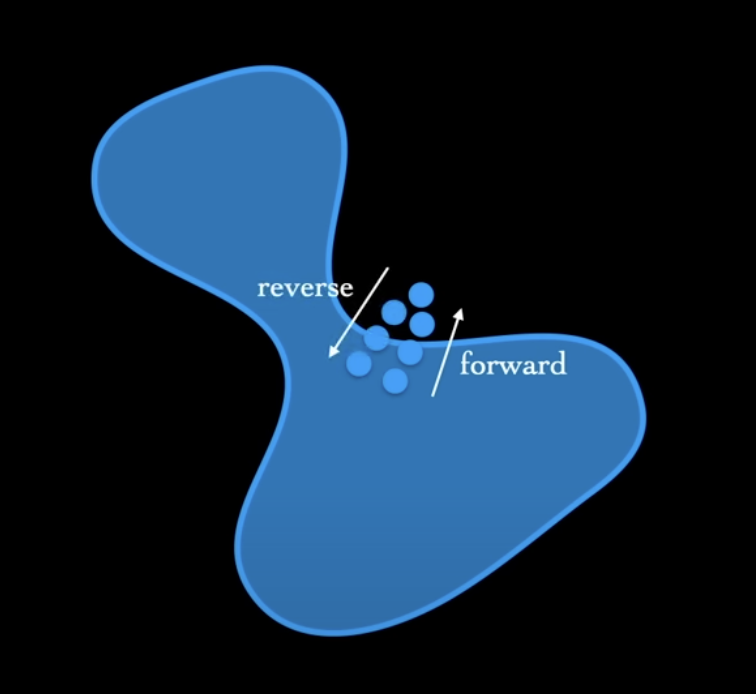

# Diffusion models

Parrtiamo da $x_0$ e aggiungiamo noise fino a $x_T$. Il processo inverso di denoising è modellato come una markov chain

$$q(x_{1:T}|x_0) = \prod_{t=1}^Tq(x_t|x_{t-1})$$

Questo è il processo di denoise. Inoltre, ogni step è gestito come una gaussiana:

$$q(x_t|x_{t-1}) = N(x_t; \sqrt{1-\beta
_t}x_{t-1},\beta_t I)$$

Dove $\beta$ è la varianza ed è tale che:

$$\beta_1 < \beta_2 < ... <\beta_T, \beta_t \in (0,1)$$

Quando $t \rightarrow \infty$ allora $q(x_T|x_0) \approx N(0,I)$ si perde tutta l'info su $x_0$. Solitamente T è dell'ordine delle migliaia. Solitamente $\beta<<1$. Il passo è piccolo per permettere un learning più facile. Ovvero, se il passo è piccolo le distribuziono della markov chain sono più simili tra di loro (step dopo step). 

I passi di bacward sono modellati allo stesso modo di quelli di foreward, ma con una varianza diversa:

$$p(x_{t-1}|x_t) = N(x_{t-1}; \mu_\theta(x_t,t), \sigma_\theta(x_t,t))$$

$t$ fa parte dell'input. Anche il processo di backward è una markov chain:

$$p_\theta(x_{0:T}) = p(x_T) \prod_{t=1}^T p_\theta(x_{t-1}|x_t)$$

$p(x_T)$ è in questo caso $N(x_T;0,I)$ come nel caso di $q$.

 

Cosa ottimizziamo noi?

Se integriamo rispetto a $dx_{1:t}$ dobbiamo integrare rispetto a tutte le direzioni che dalla noise ci portano alla distribuzione dei dati. E' intrattabile.

Possiamo supporre che $x_1,x_2,...,x_T$ siano delle variabili latenti, e $x_0$ le variabili osservabili (tipo come negli AE e VAE). Gestiamo il processo di forewarding come l'encoding e il processo di reversing come quello di decoding del VAE.

Il forward è solitamente fisso, noi apprendiamo il reverse, basta allenare solo una rete.

Data l'osservazione $x$ e la latent variable $z$ possiamo:

$$\log p_\theta(x) \ge variational \; lower \; bound$$

$$\log p_\theta (x) \ge E_{q(z|x) [\log p_\theta(x|z)] - D_{KL}(q(z|x || p_\theta(z)))}$$

Il primo termine è l'errore di ricostruzione, il secondo incoraggia la probabilità di $z$ condizionata da $x$ a essere simile alla prior. Quindi:

$$x := x_0 \;\;\; z :=x_{1:T}$$

Possiamo semplificare come:

$$E_q \bigg[ \log p(x_T) + \sum_{t\ge1} \log \frac{p_\theta(x_{t-1}|x_t)}{q(x_t|x_{t-1})}\bigg]$$

Ogni passo di foreward può essere sampled in forma chiusa senza dover simulare tutta una catena di markov. Quindi, per ogni $t$ nella sommatoria i valori possono essere facilmente calcolati. 

Il sampling di questo tipo può portare a alta varianza. Possiamo riscrivere come:

$$
E_q \bigg[-D_{KL}(q(x_T|x_0) || q(x_T)) - \sum_{t>1} D_{KL}(q(x_{t-1}|x_t,x_0) || p_\theta(x_{t-1}|x_t)) + \log p_\theta(x_0|x_1)\bigg]
$$

I primi termini a sinistra possono essere eliminati in quanti la fase di forward è fissa. 

La $D_{KL}$ è applicata su due gaussiane. 

Le varianze $\sum_\theta$ sono fissate, il processo di learning apprende solo le medie $\mu_\theta$ per $p_\theta(x_{t-1}|x_t)$

Per il sampling si usa una variabile casuale epsilon distribuita uniformemente.

$$x_t = \sqrt{\bar{\alpha_t}}x_0 + \sqrt{1-\bar
{\alpha
_t}} \epsilon\;, \; \; \; \epsilon \backsim N(0,1)$$

I DM possono essere fatti in modo tale da essere condizionati sulla base di una particolare classe

$$p_\theta (x_0 | y)$$

Dove $y$ può essere tipo una label. Si può usare un classificatore per fare questo per guidare la ricostruzione verso una particolare classe.

 