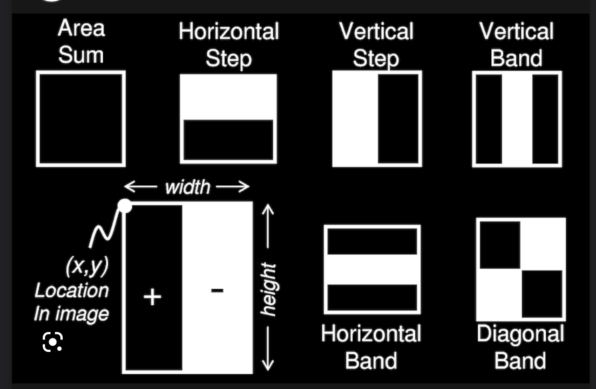

# Introduzione

individuare i keypoint, ovvero punti particolari ai quali sono associati dei descrittori, con delle proprietà che permettono di identificare in maneira invariante a delle trasformazioni questi punti (rotazione, ecc...). Estrarre features descrittive dall'immagine.

Possono essere:
- vettori
- istogrammi (frequenze, come variano)
- risposte su patches

Image patch: è una matrie quadrata, per ogni elemento corrisponde un valore. Possono essere rappresentate come vettori monodimensionali. Possiamo, a esempio, calcolare il gradiente tramite l'uso della patch.

Istogramma: nel caso più banale, si conta la frequenza dei pixel con un particolare valore. Invariante rispetto a scala e rotazione. Nella maggior parte dei metodi, si suddivide l'img in tante patch, e si calcola l'istogramma per ogni patch. In questo modo, si ottiene un descrittore per ogni patch. E' invariante rispetto alle deformazioni. 

# MOPS: multi scale oriented patches

Applica in maniera ricorsiva la suddivisione in patches dell'immagine (anche patch con angoli diversi), e per ogni patch calcola 
l'istogramma. Il numer di bin per gli istogramma sono iperparametri.

- Solitamente le patch sono 40x40
- si standardizzano i valori
- si applicano i filtri di Haar, calcolando differenza trai pixel in regione nera meno i pixel nella banda bianca. Il come varia ricorda la funzione di convoluzione con kernel per riconoscimento dei bordi, obiettivo equivalente, ma calcolo meno oneroso. E se la distinzione fosse più sfumata? Si può usare una soglia dove vario la proporzione tra pixel bianchi e pixel neri. Ci possono essere vari filtri di Haar, come quelli mostrati sotto. Ognuno sarà in grado di individuare delle caratteristiche diverse.

# SIFT

1. multiscale extrema detection
2. keypoint localization
3. orientation assignment
4. keypoint descriptor

A seconda del filtro che applico potrei riconoscere o non riconoscere un angolo.

Posso applicare l'algoritmo alla stessa immagine considerando dei filtri di Gauss con $\sigma$ sempre maggiori (la piramide gaussiana). In questo modo non vi è il problema di scala/dimensione-filtro. 

Devo quindi applicare filtri gaussiani ma anche trovare delle zone significative (i.e. dove l'img presenta picchi), uso il Laplaciano di un Gaussiano.

$$L(x,y;\sigma) = \sigma^2[\nabla^2 G(x,y;\sigma) \star f(x,y)]$$

Avrò picchi in corrispondenza di cambi di tonalità, ecc... 

Si fa la convoluzione della immaggine con il laplaciano, avremo picchi in corrispondenza delle variazioni. 

Un problema di questo operatore è che non è invariante rispetto ai cambi di scala. Se applichiamo $\sigma$ la risposta del Laplaciano sarà diversa, questo perchè la gaussiana tende a uniformare l'immagine. Si **moltiplica** il laplaciano per un certo parametro che ne amplifica il risultato.

La piramide viene suddivisa in scale di ottae, ognuna delle quali comprende $\sigma_L \;\;e \;\; 2*\sigma_L$

Filtri più piccoli : maggiori dettaglia, filtri più grandi catturano dettagli più generali. 

Considero, ogni cubo 3x3, se il valore al centro è il massimo (o minimo) lo considero come un keypoint (le dimensioni indicano i diversi layer della piramide).

Sift è un metodo per identificare delle regioni di interesse e ricavare descrittori che indicano punti significativi dell'immagine. Inizialmente il metodo è stato introdotto per correlare punti in img diverse, ma può anche essere usato per trasformazioni ma anche per caratterizzare una singola immagine. Per esempio, per costruire algoritmi di classificazione. 

In sift si calcola, per ogni patch un istogramma, ottenuto dall'orientamento dei gradienti. Per ogni punto nella regione si ottiene angolo e magnitudo del gradiente. Si calcola l'istogramma per ogni patch. Si usa la magnitudo per tener conto della differenza tra le tonalità, gli orientamenti sono pesati rispetto alla magnitudo. Alla fine il descrittore prenderà il valore della massima barra nell'istogramma.

Più elementi ci saranno nella piramide più il metodo sarà robusto.

Lista ottave = risultato di gauss su diversi valori.

Si ottiene laplaciano come differenza di due gaussiane, che abbiamo calcolato nella lista delle ottave.