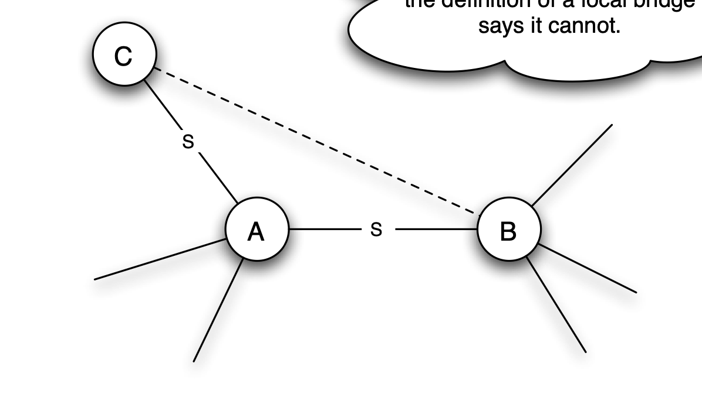

Take some network, and consider a node A that satisfies the Strong Triadic Closure Property and is involved in at least two strong ties. Now suppose A is involved in a local bridge — say, to a node B — that is a strong tie. We want to argue that this is impossible, and the crux of the argument is depicted in Figure 3.6. First, since A is involved in at least two strong ties, and the edge to B is only one of them, it must have a strong tie to some other node, which we’ll call C. Now let’s ask: is there an edge connecting B and C? Since the edge from A to B is a local bridge, A and B must have no friends in common, and so the B-C edge must not exist. But this contradicts Strong Triadic Closure, which says that since the A-B and A-C edges are both strong ties, the B-C edge must exist. This contradiction shows that our initial premise, the existence of a local bridge that is a strong tie, cannot hold, finishing the argument.